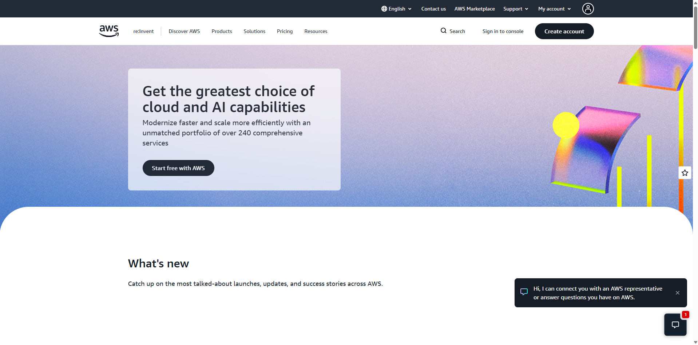

# Amazon Web Services (AWS) Platform Research

## Brief Overview
Amazon Web Services (AWS) is a comprehensive, evolving cloud computing platform provided by Amazon that includes a mixture of infrastructure as a service (IaaS), platform as a service (PaaS), and packaged software as a service (SaaS) offerings.

## Global Infrastructure
AWS spans 105+ Availability Zones across 33+ geographic regions worldwide, supported by extensive edge networking points of presence.

## Cloud Management Console
AWS Management Console is a web application that provides a broad collection of service consoles for managing compute, storage, databases, security, and developer tools.

## Core Services
* **Amazon EC2**: Scalable virtual computing capacity in the cloud.
* **Amazon S3**: Scalable object storage for data backup, archiving, and analytics.
* **Amazon VPC**: Isolated cloud resources within a custom-defined virtual network.
* **AWS IAM**: Secure management and access control for AWS services and resources.

## Key Advantages
* Pioneer and market leader with the most extensive catalog of mature services.
* Comprehensive global footprint offering low-latency deployment options.
* Extensive community support, enterprise tooling, and partner ecosystem.

## Typical Enterprise Use Cases
* Enterprise multi-tier web application hosting.
* Scalable big data processing and data lakes.
* Disaster recovery and automated multi-region backup.