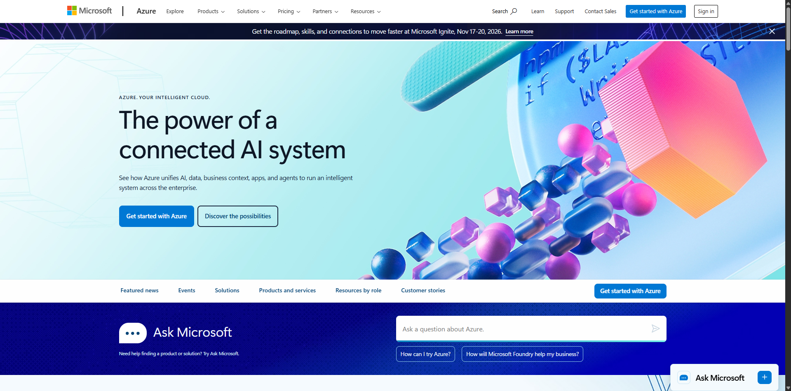

# Microsoft Azure Platform Research

## Brief Overview
Microsoft Azure is a cloud computing platform and service suite created by Microsoft for building, testing, deploying, and managing applications and services through Microsoft-managed data centers.

## Global Infrastructure
Azure has a global infrastructure consisting of 60+ regions and hundreds of data centers connected by an extensive enterprise fiber network.

## Cloud Management Console
The Azure Portal provides an intuitive, customizable web-based interface and command-line shell (Azure Cloud Shell) to deploy and monitor enterprise resources.

## Core Services
* **Azure Virtual Machines**: On-demand scalable computing resources running Windows or Linux.
* **Azure Blob Storage**: Highly scalable object storage for unstructured data.
* **Azure Virtual Network (VNet)**: Secure, private network isolation for cloud services.
* **Microsoft Entra ID (Azure AD)**: Cloud-based identity and access management solution.

## Key Advantages
* Seamless integration with Windows Server, Active Directory, and Microsoft 365 environments.
* Strong hybrid cloud capabilities through Azure Arc and Azure Stack.
* Attractive enterprise licensing and hybrid benefit cost savings.

## Typical Enterprise Use Cases
* Hybrid cloud enterprise migrations for legacy Active Directory and Windows workloads.
* Enterprise SQL database hosting and business intelligence via Synapse Analytics.
* SaaS backend infrastructure for enterprise Office 365 environments.