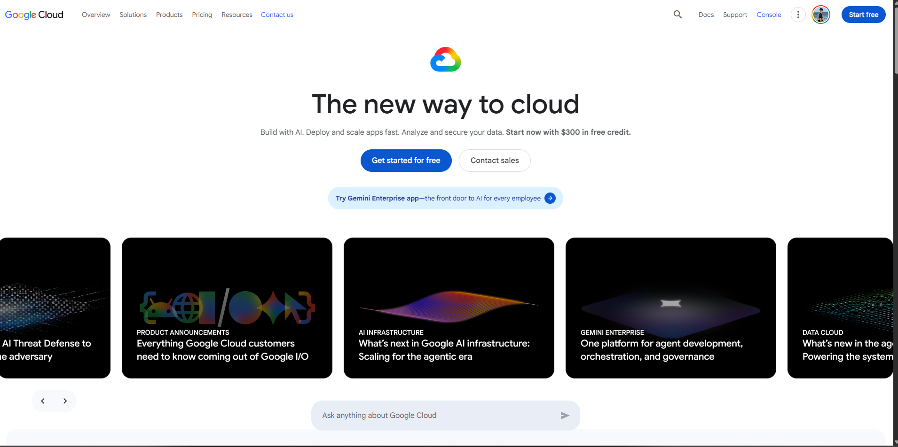

# Google Cloud Platform (GCP) Research

## Brief Overview
Google Cloud Platform (GCP) is a suite of cloud computing services that runs on the same infrastructure that Google uses internally for its end-user products, such as Google Search, Gmail, and YouTube.

## Global Infrastructure
GCP operates across 40+ regions, 120+ availability zones, and over 180+ network edge locations connected by Google's private global fiber network.

## Cloud Management Console
The Google Cloud Console provides a clean web interface for provisioning resources, monitoring real-time metrics, and running Google Cloud Shell.

## Core Services
* **Compute Engine**: High-performance virtual machine instances on Google's infrastructure.
* **Cloud Storage**: Unified, durable object storage with high availability.
* **VPC (Virtual Private Cloud)**: Global software-defined networking capabilities.
* **Cloud IAM**: Fine-grained access control and identity visibility for resources.

## Key Advantages
* Industry-leading data analytics, BigQuery data warehousing, and AI/ML capabilities.
* Native, premier support for Kubernetes via Google Kubernetes Engine (GKE).
* High-performance global private network backbone.

## Typical Enterprise Use Cases
* Real-time big data analytics and stream processing pipelines.
* Modern microservices architecture managed with Kubernetes.
* Advanced Machine Learning model development and AI training.