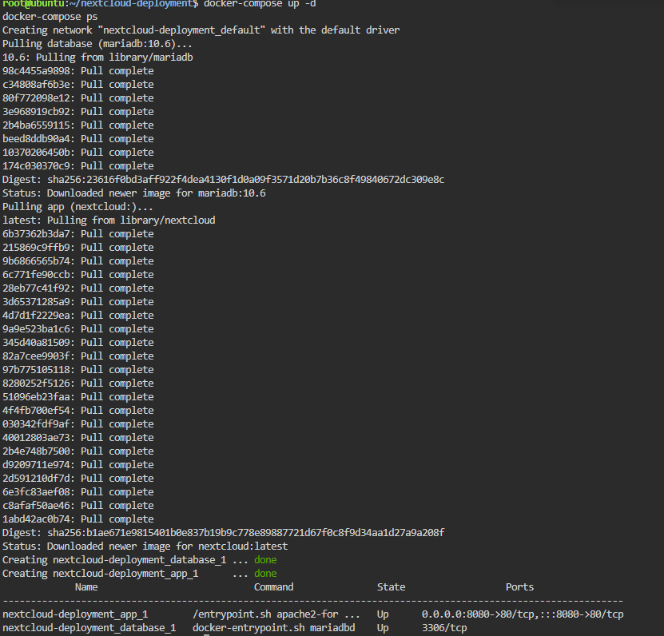
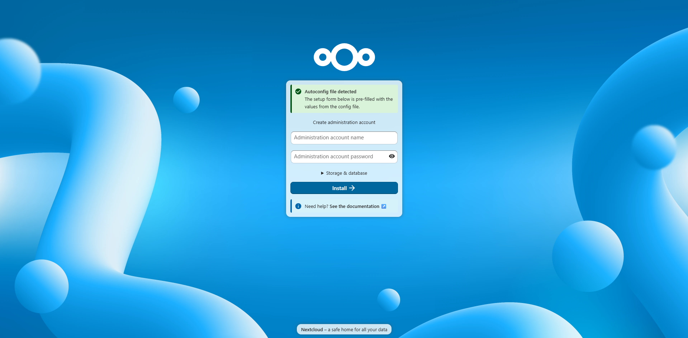
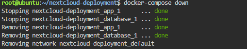

# Laboratory 06: The Cloud Deployment Engineer

## Mission Overview
Deployed a two-tier private cloud storage system (Nextcloud + MariaDB) using Docker Compose in a KillerCoda Ubuntu playground, moving from manual container commands to Infrastructure as Code.

## Objectives
- Explain multi-tier application architecture
- Understand the structure and purpose of a docker-compose.yml file
- Create configuration files using the nano text editor
- Deploy a multi-container application with Docker Compose
- Document deployment procedures in Markdown
- Expand the GitHub Cloud Computing Portfolio

## Commands Executed
```bash
mkdir nextcloud-deployment
cd nextcloud-deployment
nano docker-compose.yml
docker-compose up -d
docker-compose ps
docker-compose down
```

## Skills Learned
- Defining multi-container infrastructure in YAML
- Linking services through Compose's built-in DNS
- Passing configuration through environment variables
- Port mapping to expose a containerized app
- Editing files with nano in the terminal
- Documenting infrastructure in Markdown

## Screenshots


