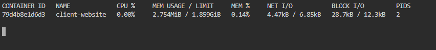

# Container Observability

## Application Log: 404 Error

Application logs record every request and error with a timestamp, status code, and requested path, so they show exactly what happened when something breaks. Without them, troubleshooting would be guesswork, but with them I can quickly find the failing request and trace it to its cause.

## Container Metrics (docker stats)
| Metric | Value |
|--------|-------|
| Container | client-website |
| CPU % | <your value> |
| Memory Usage | <your value> |

