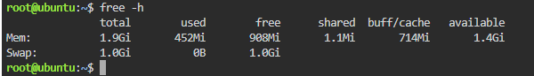
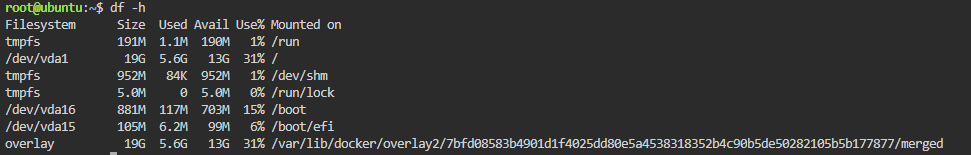

# System Baseline Report

## Host Resource Summary
| Metric | Value |
|--------|-------|
| Total RAM | 1.9 GiB (1903.2 MiB) |
| Total Root (/) Storage | 908Mi |
| CPU Idle | 97.7% |
| Load Average | 0.00, 0.03, 0.04 |

## Commands Used
- `free -h`: memory usage
- `df -h`: disk usage
- `top`: running processes and CPU load

## Screenshots

## Why Checking Disk Space Is Critical
A full disk during a traffic surge can stop services and logging from working, causing the application to crash.
